<div align="center">

# Hi, I'm Matt Hummel

<a href="https://git.io/typing-svg">
  
</a>

**Full-stack web developer · custom WordPress on the Roots stack · Microsoft Power Platform · Gettysburg, PA**

I build WordPress platforms shops can run themselves — Bedrock, Sage, and Trellis under the hood, Core Gutenberg on top — and Power Apps / Power Automate solutions for teams that live in Microsoft 365. Remote anywhere. Open for freelance, contract, or full-time.

<a href="https://matthummel.com/hire/"></a>
<a href="https://matthummel.com/contact/"></a>
<a href="https://matthummel.com/projects/"></a>
<a href="https://matthummel.com/code/"></a>
<a href="https://www.linkedin.com/in/matt-hummel-pa"></a>


<sub><a href="#build">What I build</a> · <a href="#stack">Stack</a> · <a href="#projects">Latest projects</a> · <a href="#writing">Journal</a> · <a href="#oss">Open source</a> · <a href="#play">Branchborne</a> · <a href="#activity">Activity</a> · <a href="#devs">How I work</a> · <a href="#hire">Hire</a> · <a href="#connect">Connect</a></sub>

</div>

---

<a id="build"></a>
## What I build

<table>
  <tr>
    <td width="33%" valign="top">
      <strong>Custom WordPress on the Roots stack</strong><br />
      <sub>Bedrock · Sage 11 · Trellis · Acorn · Blade · Tailwind CSS · Vite</sub><br /><br />
      Themes and platforms that shop owners edit themselves. Core Gutenberg blocks, no page builder. Composer-managed WordPress, environment config in <code>.env</code>, Docker or Trellis for local and staging.
    </td>
    <td width="33%" valign="top">
      <strong>Plugins &amp; integrations</strong><br />
      <sub>PHP 8.3 · REST · WP-CLI · WooCommerce · GitHub Actions</sub><br /><br />
      Small plugins that do one job: bookings, SEO head output, table of contents, newsletter. Standard hooks, PHPDoc, an uninstall that uninstalls. CI builds the release zip; the site pulls it.
    </td>
    <td width="33%" valign="top">
      <strong>Microsoft Power Platform</strong><br />
      <sub>Power Apps · Power Automate · SharePoint · Dataverse</sub><br /><br />
      Canvas apps and flows for teams that already live in Microsoft 365 — from years of in-house federal agency work (walkthrough under NDA). Delegation-safe queries, named formulas, flows that fail loudly.
    </td>
  </tr>
</table>

<a id="stack"></a>
## Stack

<p align="center">
  <a href="https://matthummel.com/code/#skills">
    
  </a>
</p>

| Core | Why it is in the kit |
| --- | --- |
| **PHP 8.3** | Themes, plugins, and the APIs around them. Typed, Pint-formatted, WordPress coding standards. |
| **JavaScript / TypeScript** | Small, server-first UI behavior; React where an app really needs it. |
| **Tailwind CSS v4** | Design tokens in CSS, utilities in Blade, no bloat shipped. |
| **Docker** | Reproducible local WordPress and CI; the same containers for every project. |
| **Composer** | Bedrock-style WordPress: core, plugins, and the theme are dependencies, not uploads. |
| **Power Apps · Power Automate** | Canvas apps and flows on SharePoint and Dataverse for Microsoft 365 teams. |

<sub>Groups mirror <a href="https://matthummel.com/code/">matthummel.com/code</a>. The banner is an SVG this repo rebuilds on a schedule — glyphs from simple-icons, animation off when your OS asks for reduced motion.</sub>

---

<a id="projects"></a>
## Latest projects

The four newest on [matthummel.com/projects](https://matthummel.com/projects/), refreshed by this repo's Actions. Sample work I built in public — not client sites. Each one has a live demo and a repo.

<!--START_SECTION:projects-->
<table>
  <tr>
    <td width="300" valign="top"><a href="https://matthummel.com/projects/cobbleandcandle/"></a></td>
    <td valign="top">
      <strong><a href="https://matthummel.com/projects/cobbleandcandle/">Cobble &amp; Candle</a></strong><br />
      <sub>WordPress theme · Restaurant · tavern · inn · v0.1.0</sub><br />
      Cobble &amp; Candle is a WordPress block theme for restaurants, taverns and inns. Guests see live “open now” hours, menus they can filter by diet, and book a table or a room. Owners set it up in a five-step wizard, import…<br />
      <sub>28 custom blocks &nbsp;·&nbsp; 4 style directions &nbsp;·&nbsp; WCAG 2.2 AA tested</sub><br />
      <a href="https://matthummel.com/projects/cobbleandcandle/">Project page</a> · <a href="https://cobbleandcandle.matthummel.com/">Live demo</a> · <a href="https://github.com/matthummel-pa/wp-cobbleandcandle">GitHub</a>
    </td>
  </tr>
  <tr>
    <td width="300" valign="top"><a href="https://matthummel.com/projects/tocguide/"></a></td>
    <td valign="top">
      <strong><a href="https://matthummel.com/projects/tocguide/">TOCguide</a></strong><br />
      <sub>WordPress plugin · The table of contents that reads with your reader. · v1.5.0</sub><br />
      TOCguide is a WordPress plugin that builds a table of contents from the headings in a post. The outline is in the first HTML. An optional Reading Guide adds section previews, read time, and study tools — no accounts…<br />
      <sub>Free download &nbsp;·&nbsp; 1.5.0 TOCguide identity &nbsp;·&nbsp; Server rendered</sub><br />
      <a href="https://matthummel.com/projects/tocguide/">Project page</a> · <a href="https://matthummel-pa.github.io/tocguide/">Live demo</a> · <a href="https://github.com/matthummel-pa/tocguide">GitHub</a>
    </td>
  </tr>
  <tr>
    <td width="300" valign="top"><a href="https://matthummel.com/projects/walkridge/"></a></td>
    <td valign="top">
      <strong><a href="https://matthummel.com/projects/walkridge/">WalkRidge</a></strong><br />
      <sub>WordPress theme · Tours · guides · WooCommerce · v1.7.2</sub><br />
      WalkRidge is a WordPress theme for licensed-guide tour shops. Visitors browse tours, meet guides, and book online. Operators change brand, phone, and hours in Theme Settings — no code.<br />
      <sub>10 Gutenberg blocks &nbsp;·&nbsp; WooCommerce tour shop &nbsp;·&nbsp; GPL theme pack</sub><br />
      <a href="https://matthummel.com/projects/walkridge/">Project page</a> · <a href="https://walkridge.matthummel.com/">Live demo</a> · <a href="https://github.com/matthummel-pa/wp-walkridge">GitHub</a>
    </td>
  </tr>
  <tr>
    <td width="300" valign="top"><a href="https://matthummel.com/projects/acreline/"></a></td>
    <td valign="top">
      <strong><a href="https://matthummel.com/projects/acreline/">Acreline</a></strong><br />
      <sub>WordPress theme · Homes · neighborhoods · local agents · v1.5.9</sub><br />
      Acreline is a WordPress theme for solo agents and small teams. Featured homes, agent bios, and showing requests sit on Gutenberg marketing pages. I built it so an office can set it up in WordPress without a page builder.<br />
      <sub>21 Gutenberg blocks &nbsp;·&nbsp; 5 setup wizard steps &nbsp;·&nbsp; 8 color styles</sub><br />
      <a href="https://matthummel.com/projects/acreline/">Project page</a> · <a href="https://acreline.matthummel.com/">Live demo</a> · <a href="https://github.com/matthummel-pa/wp-acreline">GitHub</a>
    </td>
  </tr>
</table>
<!--END_SECTION:projects-->

<p align="center"><sub><a href="https://matthummel.com/projects/">All projects</a> · <a href="https://matthummel.com/hire/">Hire me to adapt one</a></sub></p>

<a id="writing"></a>
## Latest from the journal

Five newest posts from [matthummel.com/blog](https://matthummel.com/blog/) — WordPress, the Roots stack, Power Platform, and how I actually work.

<!--START_SECTION:posts-->
<table>
  <tr>
    <td width="240" valign="top"><a href="https://matthummel.com/cobble-candle-a-wordpress-theme-for-inns-and-taverns/"></a></td>
    <td valign="top">
      <strong><a href="https://matthummel.com/cobble-candle-a-wordpress-theme-for-inns-and-taverns/">Cobble &amp; Candle: A WordPress Theme for Inns and Taverns</a></strong><br />
      <sub>Oct 3, 2026</sub><br />
      Cobble &amp; Candle is a WordPress block theme I built for restaurants, taverns and inns. It handles menus, live opening hours, table bookings and rooms to stay, with no page builder. Here is…<br />
      <a href="https://matthummel.com/cobble-candle-a-wordpress-theme-for-inns-and-taverns/">Read the post →</a>
    </td>
  </tr>
  <tr>
    <td width="240" valign="top"><a href="https://matthummel.com/ai-workflow-for-wordpress-development/"></a></td>
    <td valign="top">
      <strong><a href="https://matthummel.com/ai-workflow-for-wordpress-development/">My AI Workflow for WordPress Development on a Mac (Cursor, Claude Code, Grok Bot &amp; ChatGPT)</a></strong><br />
      <sub>Sep 30, 2026</sub><br />
      My AI workflow for WordPress development on a Mac: which AI tool writes, which one reviews, how a change moves from branch to release, and what I check.<br />
      <a href="https://matthummel.com/ai-workflow-for-wordpress-development/">Read the post →</a>
    </td>
  </tr>
  <tr>
    <td width="240" valign="top"><a href="https://matthummel.com/wordpress-accessibility-plugin/"></a></td>
    <td valign="top">
      <strong><a href="https://matthummel.com/wordpress-accessibility-plugin/">A WordPress accessibility plugin won’t make your site accessible. Here’s what does.</a></strong><br />
      <sub>Sep 30, 2026</sub><br />
      Overlay plugins can’t fix headings, labels, focus, contrast, alt text, or link text. What the FTC and DOJ said, a 30-minute keyboard and screen reader check, and where accessibility fits…<br />
      <a href="https://matthummel.com/wordpress-accessibility-plugin/">Read the post →</a>
    </td>
  </tr>
  <tr>
    <td width="240" valign="top"><a href="https://matthummel.com/wordpress-table-of-contents-block/"></a></td>
    <td valign="top">
      <strong><a href="https://matthummel.com/wordpress-table-of-contents-block/">The WordPress Table of Contents Block Is Coming to Core: What It Means for TOCguide</a></strong><br />
      <sub>Sep 26, 2026</sub><br />
      WordPress 7.2 plans a stable Table of Contents block with server-side rendering. What is planned, why saved headings went stale, and how I plan to keep TOCguide compatible.<br />
      <a href="https://matthummel.com/wordpress-table-of-contents-block/">Read the post →</a>
    </td>
  </tr>
  <tr>
    <td width="240" valign="top"><a href="https://matthummel.com/self-taught-wordpress-developer/"></a></td>
    <td valign="top">
      <strong><a href="https://matthummel.com/self-taught-wordpress-developer/">How I Became a Self-Taught WordPress Developer (17 Years, No Bootcamp)</a></strong><br />
      <sub>Sep 25, 2026</sub><br />
      I’m a self-taught WordPress developer with about 17 years of in-house web work: Dreamweaver and ASP, Germanna webmaster work on WP Engine, higher-ed marketing web, and a return from Power…<br />
      <a href="https://matthummel.com/self-taught-wordpress-developer/">Read the post →</a>
    </td>
  </tr>
</table>
<!--END_SECTION:posts-->

<p align="center"><sub><a href="https://matthummel.com/blog/">All posts</a> · <a href="https://matthummel.com/feed/">RSS</a> · <a href="https://dev.to/matthummeldev">DEV.to</a></sub></p>

---

<a id="oss"></a>
## Open source

| Repo | What it is | Stack |
| --- | --- | --- |
| [wp-cobbleandcandle](https://github.com/matthummel-pa/wp-cobbleandcandle) | Block theme for restaurants, taverns, and inns: live hours, diet-filtered menus, table and room bookings with iCal sync, setup wizard. | Sage 11 · Gutenberg · Alpine.js · Tailwind |
| [wp-acreline](https://github.com/matthummel-pa/wp-acreline) | Real estate theme: searchable listings with a map, agents, showing requests, 21 Gutenberg blocks, setup wizard. | Sage 11 · Gutenberg · Customizer |
| [wp-walkridge](https://github.com/matthummel-pa/wp-walkridge) | Tour-shop theme: tours, guides, and checkout through WooCommerce. | Sage 11 · WooCommerce · Gutenberg |
| [tocguide](https://github.com/matthummel-pa/tocguide) | Server-rendered Table of Contents block with an optional Reading Guide. Free, GPLv2+. | PHP · Gutenberg |
| [repofolio](https://github.com/matthummel-pa/repofolio) | Turn GitHub repos and site projects into a living portfolio for WordPress. | PHP · GitHub API · Gutenberg |
| [matthummel-theme](https://github.com/matthummel-pa/matthummel-theme) | The theme behind matthummel.com, including the live GitHub board and the social-share editor box. | Sage 11 · Blade · Tailwind v4 · Vite |
| [branchborne-gem-quest-game](https://github.com/matthummel-pa/branchborne-gem-quest-game) | Match-3 with a web-dev twist (below). | Vanilla JS canvas · Supabase · Netlify |

<sub>Every repo follows the same rules: a one-sentence description, topics like <code>wordpress</code> · <code>roots-sage</code> · <code>php</code> · <code>powerplatform</code>, a README with setup, stack, usage, and a visual overview, conventional commits that say <em>why</em>, and a <code>.gitignore</code> that keeps <code>.env</code>, <code>wp-config.php</code>, dumps, and build output out.</sub>

<a id="play"></a>
## Branchborne Gem Quest

Bejeweled-style match-3 with a web-dev twist — tech gems, pathway heroes (Frontend Mage, Backend Sentinel, WordPress Artisan, Full-Stack Ranger), live side quests, and a trophy case. Open source and looking for collaborators.

<table>
  <tr>
    <td width="300" valign="top">
      <a href="https://gregarious-custard-70cf58.netlify.app/"></a>
    </td>
    <td valign="top">
      Continuous cascades (HTML, CSS, JS, React, Git, Node, and more), Intern → Senior → Expert endgame, Dev tips on the quest rail, cloud saves via Supabase. Vanilla JS canvas engine plus a WordPress shortcode embed.<br /><br />
      <a href="https://gregarious-custard-70cf58.netlify.app/"></a>
      <a href="https://github.com/matthummel-pa/branchborne-gem-quest-game"></a><br />
      <sub><a href="https://matthummel-pa.github.io/matthummel-pa/">Pages mirror</a></sub>
    </td>
  </tr>
</table>

---

<a id="activity"></a>
## Public GitHub activity

Same idea as the live board on [matthummel.com/code](https://matthummel.com/code/): a custom 90-day heat map (newest week first, navy cells) plus the latest public pushes. Refreshed hourly from this repo's Actions — not a third-party stats card.

<!--START_SECTION:heatmap-->
<p align="center">
  <a href="https://matthummel.com/code/#gh-contributions">
    
  </a>
</p>
<!--END_SECTION:heatmap-->

### Feed

<!--START_SECTION:activity-->
_Refreshing…_
<!--END_SECTION:activity-->

### Recently pushed

<!--START_SECTION:pushed-->
_Refreshing…_
<!--END_SECTION:pushed-->

<p align="center"><sub>Full calendar, badges, and repo cards: <a href="https://matthummel.com/code/">matthummel.com/code</a></sub></p>

---

<a id="devs"></a>
## How I work

Seventeen years of in-house web work (higher-ed marketing, then SharePoint / Power Platform for federal teams). Public GitHub is the trail I started in 2025 — most production code still lives behind employer walls.

| | The useful version |
| --- | --- |
| **Day job shape** | I write PHP, Blade, and just enough JS/TS. I am not a designer — I will refer one. |
| **Happy path** | Bedrock + Sage 11 + Trellis, Acorn, Blade, Tailwind v4, Vite, PHP 8.3, WordPress 6.6+, Core Gutenberg (no page builder). |
| **Plugins** | One job each. PHPDoc, standard hooks, uninstall that actually uninstalls. |
| **Power Platform** | Delegation-safe queries, named formulas, flows with error branches. SharePoint or Dataverse, whichever the team already has. |
| **AI** | Cursor + Claude scaffold. I still read, click, and test every line that ships. |
| **PRs I like** | Small, named after the change, conventional commits (`feat`, `fix`, `docs`). Tell me how you tried it. |
| **PRs I bounce** | Drive-by refactors, page-builder add-ons, and "while I was here" diffs. |
| **Handoff** | Domain, hosting, repo, and database in the client's name. Short admin notes in plain English. |
| **Agency mode** | Silent sub is fine. You keep the client. I stay off their Slack unless you ask. |
| **Hours** | America/New_York. Async first. Overlap afternoons ET for pairing. |
| **A11y** | Keyboard paths, contrast, semantic HTML. If a shop owner cannot tab it, it is not done. |

<details>
  <summary><strong>How to drop me into a repo</strong></summary>

```text
1. Node + Composer + a local WordPress (Docker, Trellis, Studio, or wp-env). PHP 8.3.
2. Theme: composer install && npm install && npm run build
3. Do not install Elementor / ACF "because the last theme had it".
4. Open a draft PR early. I review staged URLs, not zip files in Drive.
5. If it is agency overflow: send brand, IA, and who owns hosting first.
```

</details>

<details>
  <summary><strong>package.json vibes</strong></summary>

```json
{
  "name": "matt-hummel",
  "version": "17.0.0",
  "private": false,
  "description": "Full-stack web developer · Roots-stack WordPress · Power Platform · open for work",
  "homepage": "https://matthummel.com",
  "main": "WordPress + Roots (Bedrock · Sage 11 · Trellis)",
  "scripts": {
    "dev": "cursor . && coffee --watch",
    "build": "ship accessible WordPress platforms",
    "test": "a11y + Core Web Vitals + 'can the shop edit it?'",
    "play": "open https://gregarious-custard-70cf58.netlify.app/",
    "deploy": "you own the keys"
  },
  "dependencies": {
    "wordpress": "specialty",
    "roots/bedrock": "*",
    "roots/sage": "^11",
    "roots/trellis": "*",
    "php": "8.3",
    "tailwindcss": "^4",
    "docker": "*",
    "power-platform": "canvas + flows",
    "curiosity": "*",
    "patience": "^∞"
  },
  "devDependencies": {
    "claude": "coworker",
    "cursor": "pair-programmer",
    "bad-pun-generator": "optional"
  },
  "engines": {
    "node": ">=human",
    "coffee": "required",
    "timezone": "America/New_York"
  },
  "keywords": ["wordpress", "roots-sage", "php", "powerplatform", "gettysburg", "a11y", "open-for-work"],
  "license": "MIT-and-kindness"
}
```

</details>

<a id="hire"></a>
## Open for work

**Freelance · contract · full-time · agency overflow.** Custom WordPress on the Roots stack, plugins and integrations, and Power Platform solutions. Based in Gettysburg, PA. Remote anywhere. I usually reply within one business day (ET).

**[Hire me](https://matthummel.com/hire/)** · **[Write a note](https://matthummel.com/contact/)** · **[LinkedIn](https://www.linkedin.com/in/matt-hummel-pa)**

<a id="stats"></a>
## GitHub stats

<p align="center">
  
</p>

<table align="center">
  <tr>
    <td valign="top" width="50%">
      
    </td>
    <td valign="top" width="50%">
      
    </td>
  </tr>
</table>

<a id="connect"></a>
## Connect

- 🌐 **Website:** [matthummel.com](https://matthummel.com)
- 🧪 **Live demos:** [cobbleandcandle.matthummel.com](https://cobbleandcandle.matthummel.com/) · [acreline.matthummel.com](https://acreline.matthummel.com/) · [walkridge.matthummel.com](https://walkridge.matthummel.com/)
- 📬 **Hire / contact:** [matthummel.com/hire](https://matthummel.com/hire/) · [matthummel.com/contact](https://matthummel.com/contact/)
- 🧩 **Projects + code:** [matthummel.com/projects](https://matthummel.com/projects/) · [matthummel.com/code](https://matthummel.com/code/)
- 💼 **LinkedIn:** [linkedin.com/in/matt-hummel-pa](https://www.linkedin.com/in/matt-hummel-pa)
- ✍️ **Dev.to:** [dev.to/matthummeldev](https://dev.to/matthummeldev)
- 🦋 **Bluesky:** [@matthummel](https://bsky.app/profile/matthummel.bsky.social)
- 👽 **Reddit:** [u/matt-hummel](https://www.reddit.com/user/matt-hummel)
- 📡 **RSS:** [matthummel.com/feed](https://matthummel.com/feed/)
- 🎮 **Branchborne Gem Quest:** [Play live](https://gregarious-custard-70cf58.netlify.app/) · [Game repo](https://github.com/matthummel-pa/branchborne-gem-quest-game)

<sub>Full-stack web developer · Roots-stack WordPress · Power Platform — open for work. PRs welcome; puns tolerated.</sub>
